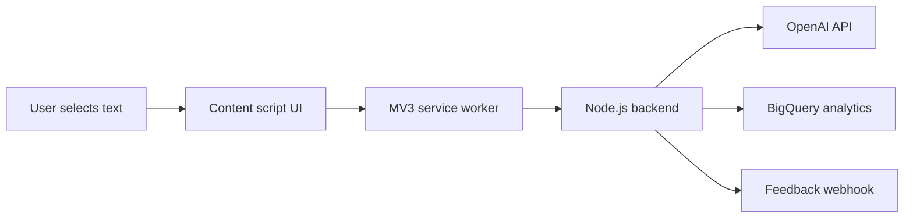

# WriteMate AI


WriteMate AI is a Chrome extension for AI-assisted translation and writing directly inside web pages. A user selects text, opens a small on-page widget, chooses an action, and receives a streamed AI result without switching tabs.

The project is built as a portfolio-ready full-stack browser extension: Manifest V3 extension, Node.js backend proxy, streaming LLM responses, usage limits, feedback collection, analytics, and Chrome Web Store packaging.

## What It Does

- Translates selected text into a preferred language
- Fixes grammar and spelling
- Improves clarity and readability
- Rewrites text in a selected tone
- Supports reply drafting for chats and email flows
- Streams the result as one progressively growing text
- Lets users copy the result or replace selected text in editable fields
- Shows a daily free-limit flow and paid-interest CTA
- Collects optional user feedback

## Architecture



More detail: [docs/architecture.md](docs/architecture.md)

## Integrations

- Chrome Extension Manifest V3
- OpenAI API for text transformation
- Node.js HTTP backend proxy
- BigQuery for product analytics events
- Feedback webhook, for example Google Apps Script to Google Sheets
- Chrome local storage for preferences, usage counters, and anonymous analytics ID
- Chrome Web Store production packaging script

## Project Structure

- `extension/` - Chrome extension source: content script, service worker, CSS, manifest, assets
- `backend/` - Node.js backend proxy and API endpoints
- `docs/` - public documentation pages, including privacy policy HTML
- `scripts/` - release packaging automation
- `PRIVACY_POLICY.md` - privacy policy source text
- `RELEASE_CHECKLIST.md` - Chrome Web Store release checklist
- `CHROME_WEB_STORE_FIELDS.md` - listing copy and permission justifications
- `SCREENSHOT_SHOTLIST.md` - screenshot plan for the store listing

## Local Development

Install backend dependencies:

```bash
cd backend
npm install
```

Create `backend/.env` from `backend/.env.example` and set at least:

```env
AI_PROVIDER=openai
OPENAI_API_KEY=...
OPENAI_MODEL=gpt-5-mini
ENABLE_MOCK_AI_FALLBACK=false
PORT=8787
```

Start the backend:

```bash
cd backend
npm start
```

Load the extension:

1. Open `chrome://extensions`
2. Enable Developer mode
3. Click "Load unpacked"
4. Select the `extension/` folder

By default, the unpacked extension uses:

```text
http://localhost:8787
```

## Backend Configuration

Recommended production variables:

```env
AI_PROVIDER=openai
OPENAI_API_KEY=...
OPENAI_MODEL=gpt-5-mini
AI_REQUEST_TIMEOUT_MS=15000
TRANSFORM_CACHE_TTL_MS=300000
TRANSFORM_CACHE_MAX_ENTRIES=200
MAX_JSON_BODY_BYTES=65536
MAX_TRANSFORM_TEXT_CHARS=12000
MAX_FEEDBACK_CHARS=2000
MAX_ANALYTICS_PROPERTIES_CHARS=8000
RATE_LIMIT_WINDOW_MS=60000
RATE_LIMIT_MAX_TRANSFORM=20
RATE_LIMIT_MAX_FEEDBACK=10
RATE_LIMIT_MAX_EVENTS=120
ENABLE_MOCK_AI_FALLBACK=false
FEEDBACK_WEBHOOK_URL=https://your-webhook.example.com/feedback
GOOGLE_APPLICATION_CREDENTIALS=./your-service-account.json
BIGQUERY_PROJECT_ID=your-gcp-project-id
BIGQUERY_DATASET_ID=lgext_analytics
BIGQUERY_EVENTS_TABLE_ID=events
CORS_ALLOWED_ORIGINS=chrome-extension://your-extension-id
```

Production hardening:

- Set `CORS_ALLOWED_ORIGINS` before release
- Keep payload size limits enabled
- Keep rate limits enabled
- Keep `ENABLE_MOCK_AI_FALLBACK=false`
- Do not commit `.env` or service-account JSON files

## Chrome Web Store Package

Create a production package with the deployed backend URL:

```bash
node scripts/package-extension.mjs --backend-url=https://your-app.up.railway.app
```

The script:

- copies `extension/` into `dist/chrome-store/`
- replaces the default backend URL in `background.js`
- narrows `host_permissions` to the production backend origin
- switches `content.js` to `BUILD_CHANNEL = "production"`
- creates `dist/WriteMateAI-chrome-<version>.zip`

Before upload, load `dist/chrome-store/` in Chrome and run a packaged smoke test.

## Privacy Policy

The privacy policy is available in two forms:

- Markdown source: [PRIVACY_POLICY.md](PRIVACY_POLICY.md)
- GitHub Pages-ready HTML: [docs/privacy-policy.html](docs/privacy-policy.html)
- GitHub Pages landing page: [docs/index.html](docs/index.html)

Live pages:

- Project page: [https://liinad-gs.github.io/WriteMateAI/](https://liinad-gs.github.io/WriteMateAI/)
- Privacy policy: [https://liinad-gs.github.io/WriteMateAI/privacy-policy.html](https://liinad-gs.github.io/WriteMateAI/privacy-policy.html)

After publishing the repository, enable GitHub Pages for the `docs/` folder to get a public HTTPS privacy policy URL for Chrome Web Store.

## Portfolio Notes

This project demonstrates:

- Browser extension architecture with Manifest V3
- DOM selection handling across textareas, inputs, contenteditable fields, and page text
- Streaming LLM UX with append-only rendering
- Backend proxy design for AI API calls
- Product analytics and event normalization
- Daily usage limits and monetization-interest tracking
- Privacy-conscious data handling for selected text
- Store packaging and release readiness

## Current Release Status

See [RELEASE_STATUS.md](RELEASE_STATUS.md) and [RELEASE_CHECKLIST.md](RELEASE_CHECKLIST.md).
