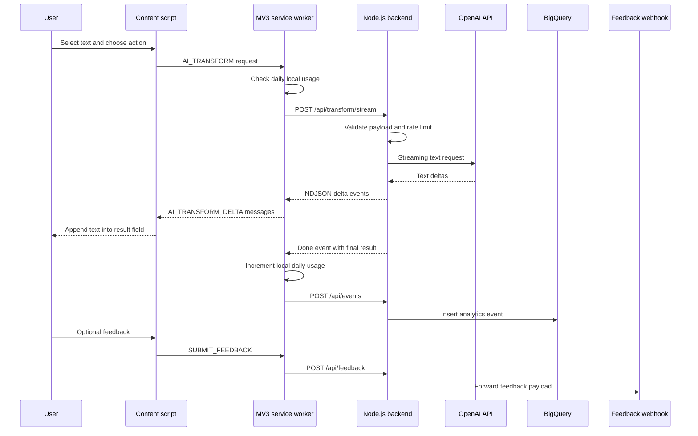

# WriteMate AI Architecture

WriteMate AI is split into a Chrome extension and a backend proxy. The extension owns the page UI and local state. The backend owns AI-provider calls, feedback forwarding, analytics ingestion, rate limits, and request validation.

## High-Level Flow



## Extension Components

- `extension/content.js`
  - Detects selections in regular pages, inputs, textareas, contenteditable fields, and Google Docs-like surfaces
  - Renders the floating trigger and action panel
  - Handles translate, grammar, improve, tone, copy, replace, onboarding, feedback, and limit UI
  - Receives streaming deltas and appends them into one progressively growing result
  - Stores UI preferences such as app language and preferred translation language

- `extension/background.js`
  - Runs as a Manifest V3 service worker
  - Enforces the local daily free usage counter
  - Calls the backend streaming transform endpoint
  - Relays streaming deltas to the content script
  - Sends analytics and feedback events
  - Stores an anonymous extension-specific analytics user ID

- `extension/manifest.json`
  - Declares the content script, background service worker, storage permission, backend host permissions, icons, and web-accessible assets

## Backend Components

- `backend/server.js`
  - Exposes `/health`, `/api/transform`, `/api/transform/stream`, `/api/feedback`, and `/api/events`
  - Validates action, target language, tone, and text length
  - Applies per-IP rate limits
  - Streams model deltas as newline-delimited JSON
  - Caches repeated transform results for a short TTL
  - Normalizes analytics events before BigQuery insertion
  - Forwards feedback to a configured HTTPS webhook

## Data Flow And Privacy

The extension sends selected text only after a user explicitly runs an action. Analytics events avoid full selected text and use metadata such as event name, page host, action, selection kind, success state, timings, and result length. Feedback text is sent only when the user submits the feedback form.

Local browser storage is used for:

- Preferred target language
- App language
- Onboarding state
- Daily usage counter
- Backend URL override
- Anonymous analytics user ID

## Limits And Monetization Interest

The unpacked development build supports debug shortcuts and a local simulated purchase flow for testing. The packaged production build switches `BUILD_CHANNEL` to `production`, which prevents debug shortcuts from registering and records paid-interest clicks without resetting the usage counter.

The backend also has independent rate limits for transform, feedback, and analytics endpoints.

## Release Build

The release package is created by:

```bash
node scripts/package-extension.mjs --backend-url=https://your-production-backend.example.com
```

The script writes a production build to `dist/chrome-store/`, narrows backend host permissions, replaces the backend URL, switches `BUILD_CHANNEL` to `production`, and creates the Chrome Web Store zip.
